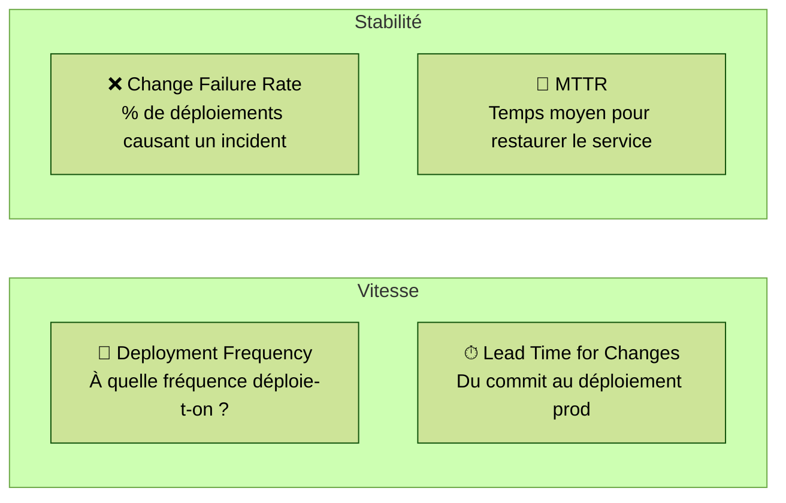
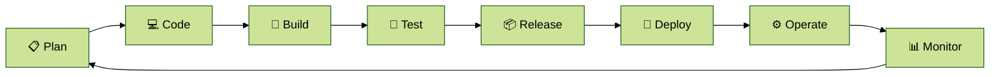

# Module 1 — Culture & philosophie DevOps

---
level: 2
---

# Objectifs du module

- Comprendre l'origine et la philosophie DevOps
- Connaître le framework CALMS
- Identifier les 4 métriques DORA
- Poser le vocabulaire commun de toute la formation

---
level: 2
---

# Le problème : le mur de la confusion

  <strong>Dev</strong> 
  Livrer vite de nouvelles fonctionnalités 
  Changer souvent 
  Mesurer la valeur produit

  <strong>Ops</strong> 
  Garantir la stabilité 
  Limiter les changements 
  Mesurer la disponibilité

  💡 Objectifs contradictoires → silos, tickets, incidents, renvoi de responsabilité

---
level: 2
---

# DevOps : définition

> DevOps est un **mouvement culturel et organisationnel** visant à rapprocher les équipes de développement et d'exploitation pour livrer de la valeur plus souvent, plus vite, et avec plus de fiabilité.

 

Ce n'est **pas** :
- Un poste ("le DevOps")
- Un outil
- Une certification

 

C'est **avant tout** une **culture de collaboration**, de **responsabilité partagée** et d'**amélioration continue**.

---
level: 2
---

# CALMS — Le framework DevOps

| **Principe** | **Ce que ça signifie concrètement** |
|---|---|
| **C**ulture | Responsabilité partagée, droit à l'erreur, rétrospectives d'incident sans culpabilisation |
| **A**utomatisation | Tout ce qui peut être répété doit être automatisé |
| **L**ean | Éliminer le gaspillage, livrer en petits lots |
| **M**esure | Décisions basées sur les données, pas les opinions |
| **S**haring | Documentation, retours d'expérience, code ouvert en interne |

  💡 Chaque module de cette formation ancre ses bonnes pratiques dans l'un de ces principes

---
level: 2
---

# DORA — Les 4 métriques de l'excellence DevOps

---
level: 2
---

# DORA — Niveaux de performance

| **Métrique** | **Bas** | **Moyen** | **Élevé** | **Elite** |
|---|---|---|---|---|
| **Fréquence de déploiement** | < 1/mois | 1/mois–1/semaine | 1/semaine–1/jour | Plusieurs fois/jour |
| **Lead time** | > 6 mois | 1 mois–6 mois | 1 sem–1 mois | < 1 heure |
| **Change failure rate** | > 15 % | 10–15 % | 0–15 % | 0–5 % |
| **MTTR** | > 6 mois | 1 sem–1 mois | < 1 jour | < 1 heure |

  Le DevOps Research & Assessment (DORA) mesure ces métriques sur +33 000 équipes depuis 2014

---
level: 2
---

# Le cycle DevOps en continu

Chaque module de cette formation couvre une ou plusieurs étapes de cette boucle.

---
level: 2
---

# Détection précoce : anticiper plutôt que subir

**Approche traditionnelle (en aval)**
- Tests en fin de cycle
- Sécurité vérifiée avant la mise en prod
- Surveillance uniquement en production

→ Corrections coûteuses et tardives

**Approche DevOps (en amont)**
- Tests dès le commit
- Sécurité intégrée dans le pipeline
- Observabilité dès le développement

→ Retour rapide, coût de correction faible

---
level: 2
---

# Bonnes pratiques — Culture DevOps

  <strong>✅ Faire</strong>
  <ul class="mt-2 text-sm">
    <li>Rétrospectives d'incident sans culpabilisation</li>
    <li>Partager les guides opérationnels et la documentation</li>
    <li>Mesurer les 4 métriques DORA régulièrement</li>
    <li>Traiter l'infrastructure comme du code</li>
    <li>Automatiser tout ce qui est répété plus de 2 fois</li>
  </ul>

  <strong>❌ Éviter</strong>
  <ul class="mt-2 text-sm">
    <li>Créer un poste "DevOps" isolé sans changer la culture</li>
    <li>Adopter des outils sans changer les processus</li>
    <li>Négliger la mesure (décisions à l'intuition)</li>
    <li>Déployer rarement, en gros lots</li>
    <li>Silos de connaissance (facteur d'indispensabilité = 1)</li>
  </ul>

---
level: 2
transition: slide-right
---

# Débrief et validation

- Parmi les 5 principes CALMS, lequel vous semble le plus difficile à mettre en place dans une équipe ? Pourquoi ?
- Imaginez un projet en groupe : quelles métriques DORA pourriez-vous déjà mesurer dès la première semaine ?
- Citez un exemple concret de tâche répétitive dans un projet (personnel, scolaire ou stage) qui gagnerait à être automatisée
