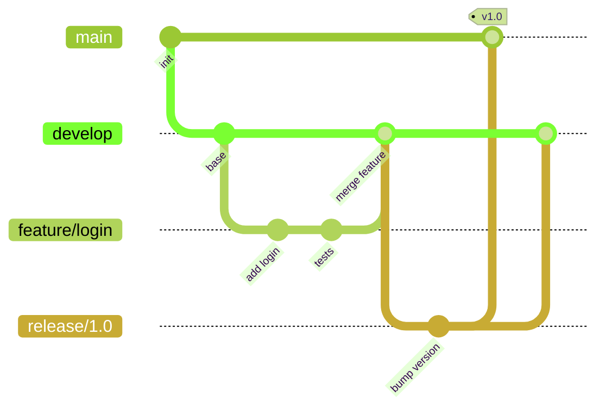
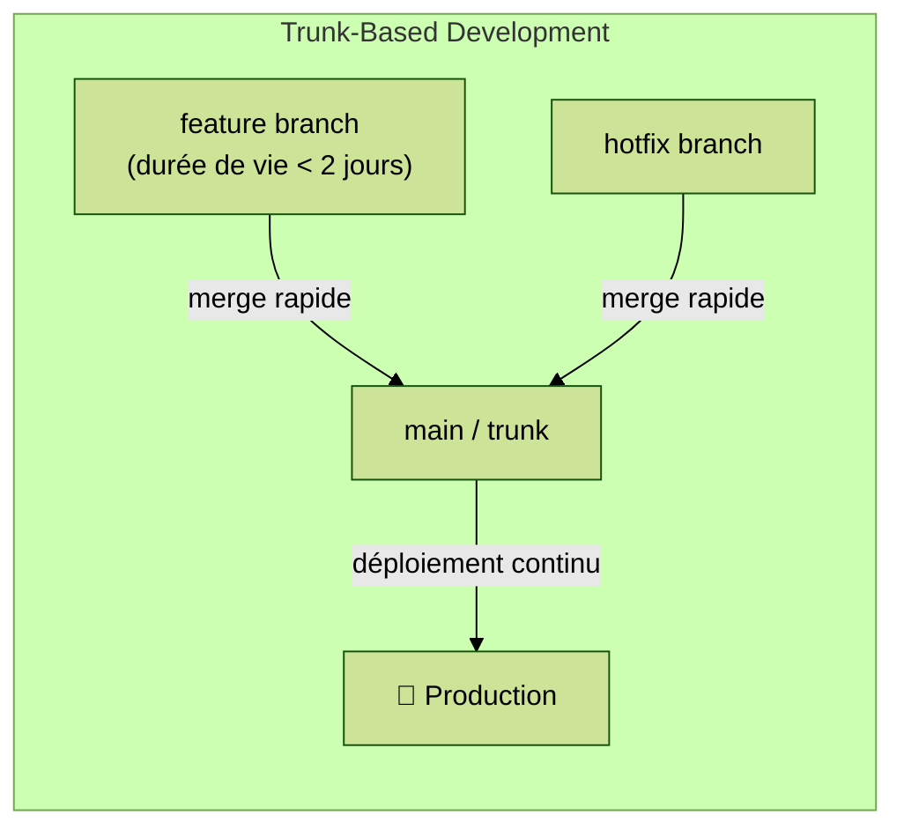

# Module 2 — Git & workflows collaboratifs

---
level: 2
---

# Objectifs du module

- Choisir une stratégie de branches adaptée à son équipe
- Structurer les revues de code (PR / MR)
- Protéger les branches critiques
- Comprendre le lien entre workflow Git et métriques DORA

---
level: 2
---

# Git en équipe : les fondamentaux

- Un commit = une **unité de changement logique et atomique**
- Le dépôt est la **source de vérité** : code, config, IaC, documentation
- Tout le monde travaille sur des branches courtes qui convergent vers le tronc principal
- L'historique Git est un **journal d'audit** : lisible, traçable, réversible

<div class="mt-4 bg-blue-50 border-l-4 border-blue-500 p-4 rounded">
  💡 <strong>CALMS — Sharing :</strong> un historique Git propre est de la documentation vivante
</div>

---
level: 2
---

# Stratégies de branches : GitFlow



Adapté aux releases planifiées, cycles longs, équipes de taille moyenne

---
level: 2
layout: two-cols-header
layoutClass: gap-4
---

# Stratégies de branches : Trunk-Based Development

::left::


::right::
Adapté à la CI/CD, intégration fréquente, feature flags pour le work-in-progress

<div class="mt-4 bg-green-50 border-l-4 border-green-500 p-4 rounded">
  💡 <strong>DORA :</strong> les équipes "Elite" pratiquent presque toutes le Trunk-Based Development
</div>


---
level: 2
---

# Pull Request / Merge Request

Une PR/MR est une **demande de revue de code** avant intégration. Elle centralise :

- La **discussion** sur les changements proposés
- L'exécution automatique **du pipeline CI**
- La **validation humaine**
- La **traçabilité** : pourquoi ce changement a été fait

<div class="grid grid-cols-2 gap-4 mt-4">

<div class="bg-green-50 border-l-4 border-green-500 p-3 rounded text-sm">
  <strong>Bonne PR</strong><br/>
  Petite (< 400 lignes)<br/>
  Description claire du "pourquoi"<br/>
  Tests inclus<br/>
  Un seul objectif
</div>

<div class="bg-red-50 border-l-4 border-red-500 p-3 rounded text-sm">
  <strong>PR à éviter</strong><br/>
  "Refacto + fix + feature"<br/>
  Sans description<br/>
  Ouverte depuis 2 semaines<br/>
  > 1 000 lignes modifiées
</div>

</div>

---
level: 2
---

# Branch protection

Les **règles de protection** de branche empêchent les modifications directes sur les branches critiques (`main`, `production`) :

- Merge uniquement après **revue approuvée** (N reviewers)
- Pipeline CI doit **passer** avant le merge
- **Commits signés** (optionnel, selon maturité)
- Historique linéaire imposé (no force-push)

Ces règles sont configurables sur tout outil Git (GitHub, GitLab, Bitbucket, Gitea…)

<div class="mt-4 bg-blue-50 border-l-4 border-blue-500 p-4 rounded">
  💡 <strong>CALMS — Culture :</strong> protéger main n'est pas de la méfiance, c'est de la rigueur collective
</div>

---
level: 2
---

# Bonnes pratiques — Git & workflows

<div class="grid grid-cols-2 gap-4">

<div class="bg-green-50 border-l-4 border-green-500 p-3 rounded">
  <strong>✅ Faire</strong>
  <ul class="mt-2 text-sm">
    <li>Commits petits et fréquents → réduit le lead time (DORA)</li>
    <li>PRs courtes → réduit le MTTR et le change failure rate</li>
    <li>Revue de code systématique → diffuse la connaissance (CALMS Partage)</li>
    <li>Branches courtes (< 2 jours de vie)</li>
    <li>Supprimer les branches mergées</li>
  </ul>
</div>

<div class="bg-red-50 border-l-4 border-red-500 p-3 rounded">
  <strong>❌ Éviter</strong>
  <ul class="mt-2 text-sm">
    <li>Committer directement sur main</li>
    <li>Branches "longues" qui divergent</li>
    <li>Merger sans CI verte</li>
    <li>Revue de code sans retour constructif</li>
    <li>Un seul relecteur systématique (facteur d'indispensabilité)</li>
  </ul>
</div>

</div>

---
level: 2
---

# TP 2 — Mise en place du repo fil rouge

> Outil utilisé dans ce TP : **GitHub**. Les concepts sont identiques sur GitLab, Bitbucket ou toute autre forge Git.

**Objectif :** initialiser le repo `formation-devops` avec une stratégie de branches

```bash
# Effectuer un fork de https://github.com/mathieulaude/formation-devops
# Clone votre repo en local
git clone <votre-repo>
cd formation-devops

# Créer la branche develop
git checkout -b develop
git push -u origin develop

# Protéger main via l'interface GitHub :
# Settings → Branches → Branch protection rules
# ✅ Require a pull request before merging
# ✅ Require status checks to pass
```

Simuler une feature : créer `feature/hello-api`, faire une PR vers `develop`, faire approuver par un binôme.

---
level: 2
transition: slide-right
---

# Débrief et validation

- Pour le projet fil rouge, quelle stratégie de branches avez-vous choisie ? Quels critères ont guidé ce choix ?
- Dans le TP, combien de temps s'est écoulé entre votre premier commit et l'intégration dans `develop` ? Comment réduire ce délai ?
- Imaginez une branche ouverte 3 semaines sans être intégrée : quelles difficultés concrètes cela crée-t-il au moment du merge ?
