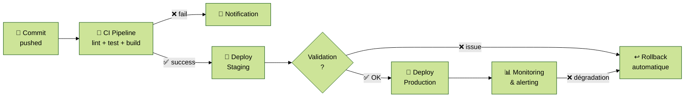

# Module 4 — Déploiement Continu (CD)

---
level: 2
---

# Objectifs du module

- Distinguer Continuous Delivery et Continuous Deployment
- Connaître les stratégies de déploiement (rolling, blue-green, canary)
- Gérer les secrets et les environnements dans un pipeline
- Déployer automatiquement sur une infrastructure cloud

---
level: 2
---

# CI vs CD : les définitions

| | **Continuous Integration** | **Continuous Delivery** | **Continuous Deployment** |
|---|---|---|---|
| **Objectif** | Valider chaque commit | Toujours prêt à déployer | Déploiement automatique en prod |
| **Déclencheur** | Chaque push | Chaque merge sur main | Chaque merge sur main |
| **Validation humaine** | Non | Oui (bouton deploy) | Non |
| **Prérequis** | Tests automatisés | CD + gates | CD + confiance totale |

<div class="mt-4 bg-blue-50 border-l-4 border-blue-500 p-4 rounded">
  💡 La plupart des équipes pratiquent <strong>Continuous Delivery</strong> avec approbation manuelle pour la prod
</div>

---
level: 2
---

# Pipeline CI → CD complet



---
level: 2
---

# Environnements

Un **environnement** est une instance isolée de l'application (infra, config, données) :

| Env | Rôle | Déploiement |
|---|---|---|
| **dev / preview** | Test d'une PR, feedback rapide | Automatique sur chaque PR |
| **staging** | Pré-production, validation QA | Automatique sur merge main |
| **production** | Utilisateurs finaux | Manuel (approbation) ou automatique |

Règles d'or :
- **Staging est identique à prod** (même image, même config, même taille)
- Les différences entre envs ne sont que dans les **variables de configuration**

---
level: 2
---

# Stratégies de déploiement

| Stratégie | Principe | Rollback | Risque |
|---|---|---|---|
| **Recreate** | Stop v1 → Start v2 | Manuel | Downtime |
| **Rolling update** | Remplace instances une par une | Automatique | Versions mixtes temporaires |
| **Blue-Green** | Deux envs identiques, bascule du routage | Instantané | Coût infrastructure x2 |
| **Canary** | Déploiement progressif (5% → 25% → 100%) | Immédiat | Complexe à mesurer |

<div class="mt-4 bg-blue-50 border-l-4 border-blue-500 p-4 rounded">
  💡 <strong>DORA :</strong> le rollback automatique est un levier majeur pour réduire le MTTR
</div>

---
level: 2
---

# Gestion des secrets dans les pipelines

Les secrets (tokens, mots de passe, clés API) ne doivent **jamais** être dans le code source.

**Règle absolue :** un secret dans Git = compromis, même dans un commit supprimé.

Mécanismes courants :
- **Variables d'environnement chiffrées** dans l'outil CI (GitHub Secrets, GitLab Variables…)
- **Gestionnaire de secrets** dédié (HashiCorp Vault, AWS Secrets Manager, Scaleway Secret Manager…)
- **OIDC / Workload Identity** : le pipeline prouve son identité sans secret statique — méthode recommandée

```yaml
# Exemple GitHub Actions — bon usage des secrets
- name: Deploy
  env:
    API_TOKEN: ${{ secrets.SCALEWAY_API_TOKEN }}
  run: ./deploy.sh
```

---
level: 2
---

# Feature flags

Un **feature flag** est un interrupteur en production qui active/désactive une fonctionnalité sans déploiement.

Utilité dans une stratégie CD :
- Déployer du code inachevé sans le rendre visible (Trunk-Based Development)
- Déployer progressivement (canary sans routage infra)
- Rollback instantané sans redéploiement

Outils : Unleash (open source), LaunchDarkly, Flagsmith, OpenFeature (standard)

---
level: 2
---

# Bonnes pratiques — Déploiement Continu

<div class="grid grid-cols-2 gap-4">

<div class="bg-green-50 border-l-4 border-green-500 p-3 rounded">
  <strong>✅ Faire</strong>
  <ul class="mt-2 text-sm">
    <li>Déployer souvent, en petits lots → augmente la fréquence de déploiement (DORA)</li>
    <li>Automatiser le rollback → réduit le MTTR (DORA)</li>
    <li>Environments identiques → élimine les diffs de config (CALMS Lean)</li>
    <li>Secrets via gestionnaire dédié, jamais dans le code</li>
    <li>Valider staging avant prod sans exception</li>
  </ul>
</div>

<div class="bg-red-50 border-l-4 border-red-500 p-3 rounded">
  <strong>❌ Éviter</strong>
  <ul class="mt-2 text-sm">
    <li>Déploiements manuels via SSH "à la main"</li>
    <li>Prod différente de staging en config réseau ou version</li>
    <li>Secrets en dur dans les variables d'env du repo</li>
    <li>Déploiements en vendredi soir</li>
    <li>Absence de mécanisme de rollback</li>
  </ul>
</div>

</div>

---
level: 2
---

# TP 4 — Déploiement automatique sur Scaleway

> Outil utilisé dans ce TP : **GitHub Actions + Scaleway**. La démarche (build → publish → deploy) est identique avec tout provider cloud.

**Objectif :** déployer automatiquement l'image de l'app sur une instance Scaleway

```bash
# Voir 03-cd-scaleway/README.md
```

**Sécurité :**
- Ne jamais stocker les secrets dans le code ou dans un fichier .env versionné
- Utiliser des clés SSH Ed25519 (plus courtes et plus sûres que RSA)
- Restreindre les droits IAM Scaleway au strict minimum (principe moindre privilège)
- Faire tourner les secrets régulièrement

**À explorer :**
1. Introduire un bug → observer le pipeline bloquer avant staging
2. Déclencher un rollback manuellement
3. Vérifier que les secrets ne s'affichent pas dans les logs

---
level: 2
transition: slide-right
---

# Débrief et validation

- Quelle stratégie de déploiement correspond le mieux à la tolérance aux risques de votre équipe ?
- Comment éviter qu'un secret soit accidentellement affiché dans les logs d'un pipeline ?
- Pourquoi Staging identique à Prod est-il une règle non négociable ?

<div class="mt-4 bg-blue-50 border-l-4 border-blue-500 p-4 rounded">
  💡 <strong>Pensez à supprimer votre instance Scaleway + IP + Stockage</strong>
</div>