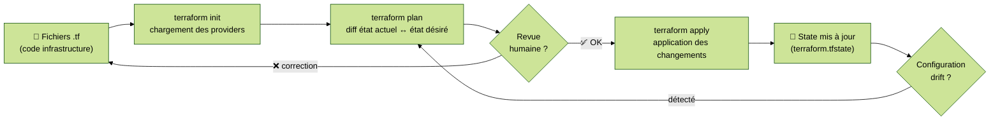
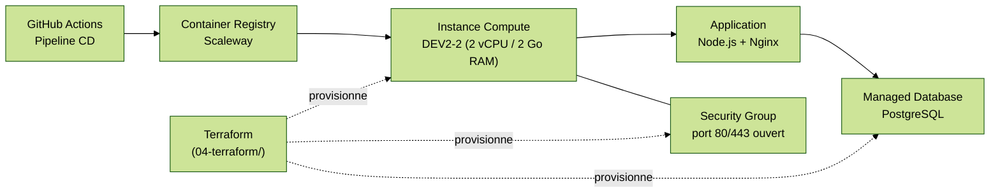

# Module 5 — Infrastructure as Code (IaC)

---
level: 2
---

# Objectifs du module

- Comprendre la différence entre IaC déclaratif et impératif
- Maîtriser le workflow Terraform (init / plan / apply)
- Gérer le state et éviter le configuration drift
- Intégrer Terraform dans un pipeline CI/CD

---
level: 2
---

# Avant l'IaC : l'infra manuelle

<div class="grid grid-cols-2 gap-8 mt-4">

<div class="bg-red-50 border-l-4 border-red-500 p-4 rounded">
  <strong>Infra manuelle</strong>
  <ul class="mt-2 text-sm">
    <li>Créée via une interface graphique</li>
    <li>Documentée dans un wiki (souvent obsolète)</li>
    <li>Impossible à reproduire exactement</li>
    <li>Chaque serveur est unique → irremplaçable</li>
    <li>Modifications non traçables</li>
  </ul>
</div>

<div class="bg-green-50 border-l-4 border-green-500 p-4 rounded">
  <strong>Infra as Code</strong>
  <ul class="mt-2 text-sm">
    <li>Décrite dans des fichiers texte versionnés</li>
    <li>Reproductible à l'identique sur n'importe quel env</li>
    <li>Reviewable (PR, diff, commentaires)</li>
    <li>Auditée (historique Git)</li>
    <li>Testable</li>
  </ul>
</div>

</div>

---
level: 2
---

# IaC déclaratif vs impératif

| | Impératif | Déclaratif |
|---|---|---|
| **Principe** | "Fais ça, puis ça, puis ça" | "Voilà l'état désiré" |
| **Exemples** | Bash, Ansible, scripts cloud-init | Terraform, Pulumi, CloudFormation |
| **Idempotence** | À gérer manuellement | Garantie par l'outil |
| **Drift** | Invisible | Détecté (`plan`) |

**Idempotence :** exécuter le code 1x ou 10x produit le même résultat.

<div class="mt-4 bg-blue-50 border-l-4 border-blue-500 p-4 rounded">
  💡 <strong>CALMS — Automatisation :</strong> décrire l'état désiré est plus fiable que décrire les étapes pour y arriver
</div>

---
level: 2
---

# Terraform : workflow



---
level: 2
---

# Les concepts Terraform essentiels

**Provider :** plugin qui connecte Terraform à un service (Scaleway, AWS, GitHub, PostgreSQL…)

**Resource :** un objet d'infrastructure géré par Terraform (`scaleway_instance_server`, `scaleway_container_registry`…)

**Variable :** paramètre d'entrée (type, valeur par défaut, validation)

**Output :** valeur exportée (ex: IP publique d'une instance) réutilisable par d'autres modules

**State :** fichier JSON décrivant l'infra réelle telle que Terraform la connaît — à stocker en remote (Object Storage S3-compatible)

---
level: 2
---

# Architecture TP — Infra Scaleway



---
level: 2
---

# Exemple Terraform — Provider Scaleway

```hcl
# terraform/main.tf
terraform {
  required_providers {
    scaleway = {
      source  = "scaleway/scaleway"
      version = "~> 2.40"
    }
  }
  backend "s3" {
    bucket = "tf-state-formation"
    key    = "devops-app/terraform.tfstate"
    region = "fr-par"
    # endpoint Scaleway Object Storage
    endpoint = "https://s3.fr-par.scw.cloud"
  }
}

resource "scaleway_instance_server" "app" {
  type  = "DEV2-2"
  image = "ubuntu_jammy"
  name  = "formation-devops"
  tags  = ["formation", "devops"]
}
```

---
level: 2
---

# State : le cœur de Terraform

Le **state** (`terraform.tfstate`) est le registre de l'infra telle que Terraform la connaît.

**State local :** dangereux en équipe (conflits, perte)

**State remote :** stocké dans un backend partagé (S3, GCS, Terraform Cloud…)

```
équipe           →   terraform plan / apply   →   Remote State Backend
(plusieurs devs)                                  (Object Storage S3)
```

Verrou automatique : un seul `apply` à la fois → pas de conflits parallèles

<div class="mt-4 bg-blue-50 border-l-4 border-blue-500 p-4 rounded">
  💡 <strong>CALMS — Partage :</strong> le state remote permet à toute l'équipe de travailler sur la même infra
</div>

---
level: 2
---

# Bonnes pratiques — IaC

<div class="grid grid-cols-2 gap-4">

<div class="bg-green-50 border-l-4 border-green-500 p-3 rounded">
  <strong>✅ Faire</strong>
  <ul class="mt-2 text-sm">
    <li>Infra versionnée et reviewable → Automatisation + Partage (CALMS)</li>
    <li>Pas de serveur long terme → Culture de l'éphémère</li>
    <li>State en remote + locking → Collaboration fiable</li>
    <li><code>terraform plan</code> en CI avant tout <code>apply</code></li>
    <li>Approbation humaine du plan en PR avant apply</li>
  </ul>
</div>

<div class="bg-red-50 border-l-4 border-red-500 p-3 rounded">
  <strong>❌ Éviter</strong>
  <ul class="mt-2 text-sm">
    <li>State local versionné dans Git (données sensibles)</li>
    <li>Modifier l'infra via l'UI après un <code>apply</code> (drift)</li>
    <li>Appliquer sans plan préalable</li>
    <li>Un seul fichier <code>main.tf</code> de 1 000 lignes</li>
    <li>Hardcoder des secrets dans les fichiers .tf</li>
  </ul>
</div>

</div>

---
level: 2
---

# TP 5 — Provisionner l'infra avec Terraform

> Outil utilisé dans ce TP : **Terraform + Scaleway**. Le workflow est identique avec AWS, GCP, Azure ou tout autre provider.

**Objectif :** provisionner l'instance et le container registry via Terraform, déclenché depuis le pipeline

📄 Les étapes détaillées sont décrites dans [src/04-terraform/README.md](../src/04-terraform/README.md) :

1. **Installation** — CLI Scaleway (`scw`) et Terraform
2. **Configuration API** — création de la clé API, authentification, variables d'environnement
3. **State remote** — bucket Object Storage Scaleway (optionnel mais recommandé en équipe)
4. **Workflow** — `terraform init` → `terraform plan` → `terraform apply` → `terraform output`
5. **Exercices** — changer le type d'instance, ajouter un tag, inspecter le state
6. **Nettoyage** — `terraform destroy`

---
level: 2
transition: slide-right
---

# Débrief et validation

- Quelle est la différence entre `terraform plan` et `terraform apply` ?
- Pourquoi le state ne doit-il jamais être dans Git ?
- Comment détecter et corriger un configuration drift ?
