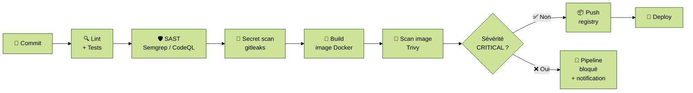

# Module 7 — DevSecOps

---
level: 2
---

# Objectifs du module

- Comprendre le principe du shift-left security
- Identifier les 4 familles de contrôles sécurité dans un pipeline
- Savoir configurer scan d'image, détection de secrets et analyse statique
- Éviter la fatigue d'alerte en calibrant les security gates

---
level: 2
---

# Pourquoi "DevSecOps" ?

**Approche traditionnelle :** la sécurité est une phase en fin de cycle, gérée par une équipe dédiée qui ouvre des tickets.

**Conséquences :** corrections coûteuses et tardives, friction entre équipes, sécurité perçue comme un frein.

**DevSecOps :** intégrer la sécurité **à chaque étape du cycle DevOps** — dans le code, dans le pipeline, dans l'infra.

<div class="mt-4 bg-blue-50 border-l-4 border-blue-500 p-4 rounded">
  💡 <strong>CALMS — Culture :</strong> la sécurité n'est pas un ticket vers une autre équipe. C'est la responsabilité de chaque développeur.
</div>

---
level: 2
---

# Les 4 familles de contrôles sécurité

| Type | Objet | Outil |
|---|---|---|
| **SAST** (Static Application Security Testing) | Code source | Semgrep, CodeQL, SonarCloud |
| **SCA** (Software Composition Analysis) | Dépendances | OWASP Dependency-Check, `npm audit`, Trivy |
| **Secret detection** | Secrets dans le code / historique | gitleaks, trufflehog |
| **Container scanning** | Image Docker | Trivy, Grype, Snyk |

---
level: 2
---

# Pipeline avec security gates



---
level: 2
---

# Trivy — Scan d'image

**Trivy** est un scanner open source qui détecte les CVEs dans les images Docker, les dépendances et les fichiers de config IaC.

```yaml
# .github/workflows/ci.yml — job scan (extrait)
- name: Scan image with Trivy
  uses: aquasecurity/trivy-action@master
  with:
    image-ref: app:${{ github.sha }}
    format: table
    exit-code: '1'
    severity: 'CRITICAL'   # bloquer uniquement sur CRITICAL
    ignore-unfixed: true   # ignorer les CVEs sans patch disponible
```

Bonne pratique : **ne bloquer que sur CRITICAL** au début → élargir progressivement (HIGH) une fois la dette technique résorbée.

---
level: 2
---

# gitleaks — Détection de secrets

**gitleaks** scanne l'historique Git et le code source à la recherche de secrets (tokens, clés API, mots de passe…)

```yaml
# Intégration pipeline CI
- name: Detect secrets with gitleaks
  uses: gitleaks/gitleaks-action@v2
  env:
    GITHUB_TOKEN: ${{ secrets.GITHUB_TOKEN }}
```

**Pre-commit hook** (recommandé en plus du pipeline) :
```bash
# Installation locale
brew install gitleaks
# Hook pre-commit
echo "gitleaks protect --staged" >> .git/hooks/pre-commit
chmod +x .git/hooks/pre-commit
```

<div class="mt-4 bg-blue-50 border-l-4 border-blue-500 p-4 rounded">
  💡 Un secret dans Git = compromis définitivement. <code>git log</code> conserve l'historique même après suppression du fichier.
</div>

---
level: 2
---

# SAST — Analyse statique

**Semgrep** et **CodeQL** analysent le code source à la recherche de patterns vulnérables (injections, authentification faible, mauvais usage de crypto…)

```yaml
# CodeQL via GitHub Actions (natif, gratuit sur repos publics)
- name: Initialize CodeQL
  uses: github/codeql-action/init@v3
  with:
    languages: javascript-typescript

- name: Perform CodeQL Analysis
  uses: github/codeql-action/analyze@v3
```

Équivalents : GitLab SAST (intégré), SonarCloud, Semgrep OSS (auto-hébergeable, outil-agnostique)

---
level: 2
---

# OWASP Top 10 dans les pipelines DevOps

| Risque | Impact pipeline |
|---|---|
| A01 — Contrôle d'accès cassé | Vérifier les permissions OIDC des runners CI |
| A02 — Echecs cryptographiques | Trivy détecte TLS faible, secrets dans les images |
| A03 — Injection | SAST (CodeQL/Semgrep) sur le code |
| A05 — Mauvaise configuration sécurité | Trivy --scanners config sur les fichiers IaC |
| A09 — Journalisation insuffisante | Vérifier que les pipelines loggent sans exposer de secrets |

---
level: 2
---

# Bonnes pratiques — DevSecOps

<div class="grid grid-cols-2 gap-4">

<div class="bg-green-50 border-l-4 border-green-500 p-3 rounded">
  <strong>✅ Faire</strong>
  <ul class="mt-2 text-sm">
    <li>Security as code → Automatisation + Partage (CALMS)</li>
    <li>Bloquer uniquement sur CRITICAL → Lean, éviter la fatigue d'alerte</li>
    <li>Developer-first security → culture, pas un ticket séparé</li>
    <li>Politique d'images de base : image officielle + non-root</li>
    <li>Pre-commit hooks en complément du pipeline</li>
  </ul>
</div>

<div class="bg-red-50 border-l-4 border-red-500 p-3 rounded">
  <strong>❌ Éviter</strong>
  <ul class="mt-2 text-sm">
    <li>Bloquer sur tous les niveaux dès le départ (LOW/MEDIUM) → adoption bloquée</li>
    <li>Scanner uniquement en prod ou "avant la release"</li>
    <li>Ignorer définitivement les CVEs CRITICAL sans justification</li>
    <li>Image <code>:latest</code> non scannée</li>
    <li>Secrets en dur dans les fichiers de config versionné</li>
  </ul>
</div>

</div>

---
level: 2
---

# TP 7 — Security gates dans le pipeline CI

> Outil utilisé dans ce TP : **GitHub Actions + Trivy + gitleaks**. Les outils sont CI-agnostiques et s'intègrent dans tout pipeline.

**Objectif :** ajouter les jobs de sécurité dans le workflow CI de l'app fil rouge

```bash
cd formation-devops/06-devsecops/
# 3 jobs ajoutés dans .github/workflows/ci.yml :
# secret-scan, sast, image-scan

# Tester la détection de secret :
echo 'const token = "SCW_SECRET_KEY_abc123xyz"' >> src/config.js
git add src/config.js
git commit -m "test: add fake secret"
git push
# → Observer le pipeline bloquer sur le job secret-scan
```

**À explorer :**
1. Introduire une CVE connue (downgrade une dépendance) → observer Trivy
2. Consulter le rapport SARIF CodeQL dans l'onglet Security → Code scanning
3. Configurer un `.gitleaksignore` pour exclure un faux positif

---
level: 2
transition: slide-right
---

# Débrief et validation

- Pourquoi vaut-il mieux bloquer uniquement sur CRITICAL au démarrage ?
- Un développeur commet accidentellement une clé API. Elle est supprimée dans le commit suivant. Est-elle compromise ?
- Comment organiser la remontée des alertes sécurité sans créer de la friction ?
